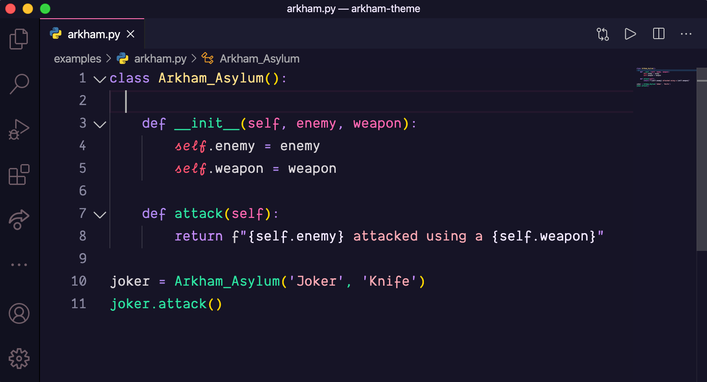
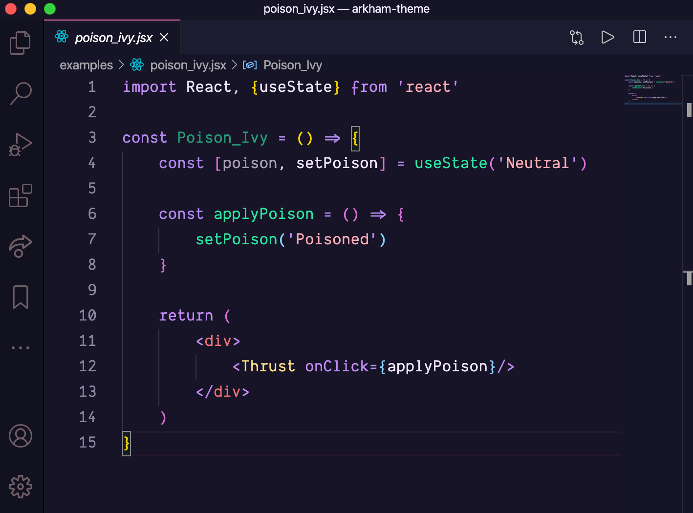

# Arkham Theme 🦇
#### Theme with inspirations on Transylvania and Mayukai Alucard 🌑

---

## Installing 💻

-  Go to `View -> Command Palette` or type `Ctrl+Shift+P`/`cmd+Shift+P`
-  Then enter `Install Extension`
-  Write `Arkham`
-  Select it or press Enter to install
-  Enjoy 🎉

## Activating theme ⚡️

Run Visual Studio Code. The Arkham Theme will be available from File -> Preferences -> Color Theme dropdown menu.
