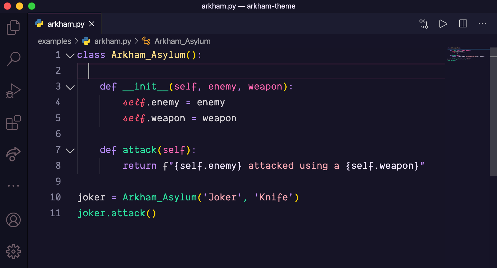
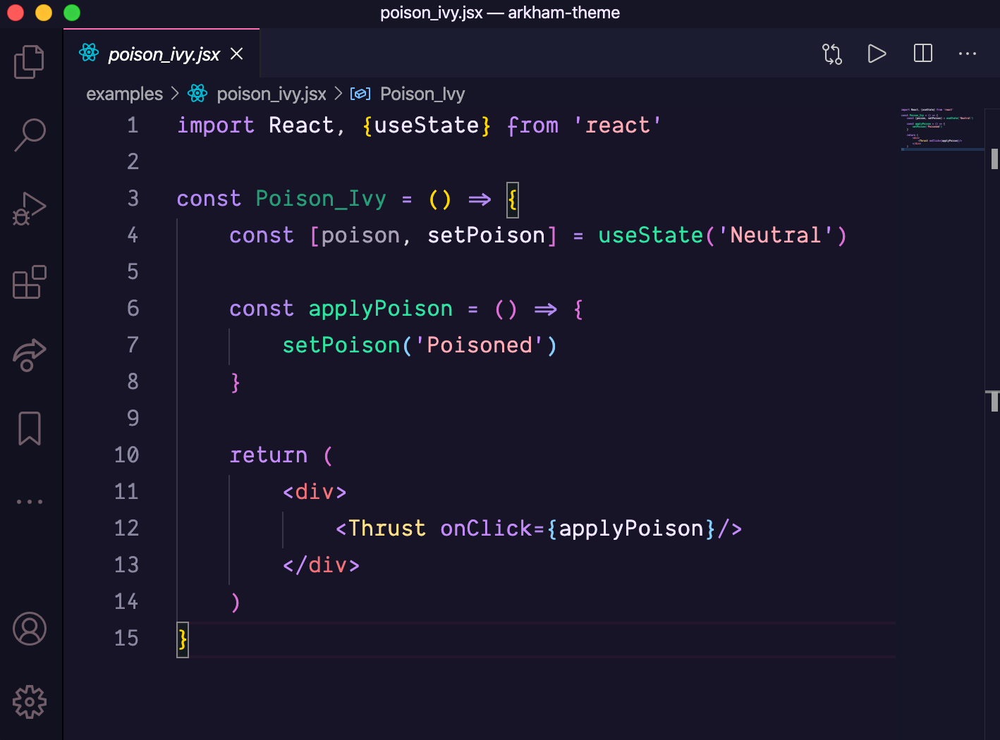
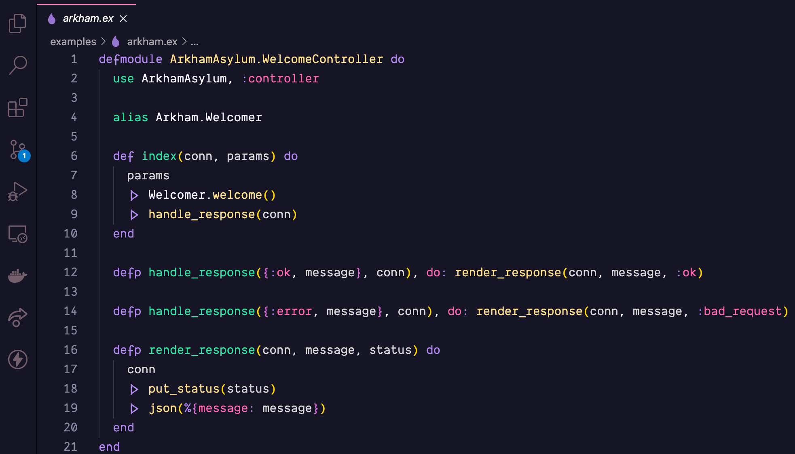
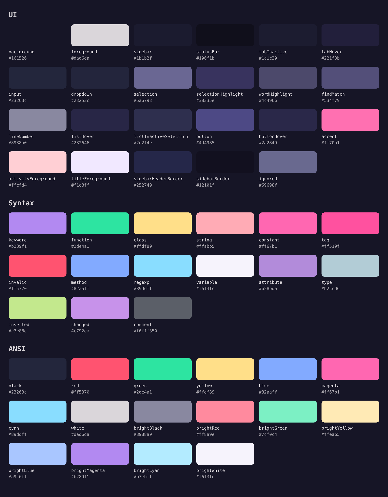

# Arkham Theme 🦇
#### Theme with inspirations on Transylvania and Mayukai Alucard 🌑



---



---



## Installing 💻

-  Go to `View -> Command Palette` or type `Ctrl+Shift+P`/`cmd+Shift+P`
-  Then enter `Install Extension`
-  Write `Arkham`
-  Select it or press Enter to install
-  Enjoy 🎉

## Activating theme ⚡️

Run Visual Studio Code. The Arkham Theme will be available from File -> Preferences -> Color Theme dropdown menu.

## Cursor 🖱

Cursor installs extensions from [Open VSX](https://open-vsx.org). Once Arkham is published there, search `Arkham` in the Extensions panel like in VS Code.

Until then, install the VSIX by hand:

-  Download `arkham-theme-1.14.0.vsix` from [Releases](https://github.com/lucasmsa/arkham-theme/releases)
-  In Cursor, open the Command Palette and run `Extensions: Install from VSIX...`
-  Pick the file, then choose Arkham in the Color Theme dropdown

## Palette 🎨

Every color lives once in [`palette.json`](palette.json): UI roles, syntax roles and the 16 ANSI colors. The VS Code theme stays hand-tuned; a test pins each palette value to it, and every port below is generated from it.



## Ports 🧳

Generated files live in [`ports/`](ports). Install steps, one line each:

| App | File | Install |
| --- | --- | --- |
| Chrome | `ports/chrome/manifest.json` | Open `chrome://extensions`, turn on Developer mode, click Load unpacked, pick the `ports/chrome` folder (or unzip the release zip) |
| Ghostty 👻 | `ports/ghostty/Arkham` | Copy to `~/.config/ghostty/themes/Arkham`, then set `theme = Arkham` in your Ghostty config |
| iTerm2 | `ports/iterm2/Arkham.itermcolors` | Double-click the file, then pick Arkham under Profiles, Colors, Color Presets |
| Alacritty | `ports/alacritty/arkham.toml` | Add `[general] import = ["~/.config/alacritty/arkham.toml"]` after copying the file there |
| Kitty | `ports/kitty/arkham.conf` | Copy to `~/.config/kitty/arkham.conf` and add `include arkham.conf` to `kitty.conf` |
| WezTerm | `ports/wezterm/arkham.toml` | Copy to `~/.config/wezterm/colors/arkham.toml` and set `config.color_scheme = 'Arkham'` |
| Zed | `ports/zed/arkham.json` | Copy to `~/.config/zed/themes/arkham.json`, then pick Arkham in the theme selector |
| Warp | `ports/warp/arkham.yaml` | Copy to `~/.warp/themes/arkham.yaml`, then pick it in Settings, Appearance, Themes |

Chrome themes ship as an unpacked folder because the Chrome Web Store charges a one-time developer registration fee. The zip attached to each release is the same folder.

## Terminals everywhere 🌍

Ghostty, Alacritty, Kitty, WezTerm, Windows Terminal and about thirty other terminals get their built-in schemes from [mbadolato/iTerm2-Color-Schemes](https://github.com/mbadolato/iTerm2-Color-Schemes). Submitting `ports/iterm2/Arkham.itermcolors` to its `schemes/` folder (plus a README and CREDITS line, as its Contribute section asks) ships Arkham into all of them.

## Development 🔧

```sh
npm install
npm run build        # regenerate ports/ from palette.json
npm test             # palette pins, contrast, format checks, snapshots
npm run zip:chrome   # dist/arkham-chrome.zip
npm run package      # .vsix
OVSX_PAT=... npm run publish:ovsx
```

Decisions are recorded in [`docs/adr`](docs/adr).
